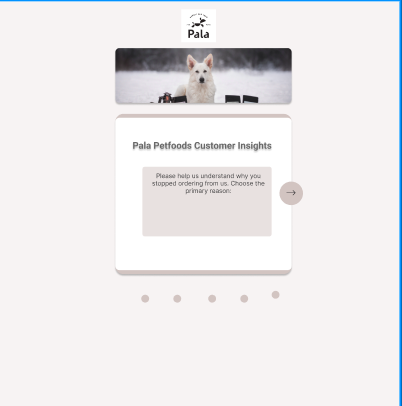

<h1 align="center">
  <a href="">
    
  </a>
</h1>

# Survey Project

This Survey Project has been a collaboration between Sakura Tanaka, Mikael Öling and Elba Cacan. 

Our vision was to craft a survey that aligned with the practical needs of Mikael's clients, focusing on real life senarios and applications. The aim was to create a vertisale survery tool, designed to be easily modified and taylored if needed. 

## Getting Started with the Project

Mikael provided us with visual aids and questions relevant for the survey, and Sakura created a design for our project in figma inspired by the provided materials.



To maintain coherence we began with a multi step component stucture. When this was in place we each made our own branches, but before that we agreed on how to devide the tasks. We allowed each member to chose the components that they wanted to do. Our strategy revolved around frequently merging branches and pulling updated versions to our local copies. Any significant change or addition made, that was not agreed upon upfront, was clearly communicated to the team in a group chat.  

This week was a lot about shared learning for us. We spent some time exchanging knowledge on various topics, including merging techniques, terminal usage, and handy shortcuts. By sharing our knowledge we all incresed our skills. 


### The Problem

Due to varying commitments and differences in time zones, sceduling meetings was somewhat challenging. Despite this, a mutual understanding of our goal and the project requirements ensured we got the project done. A project we are happy with.  

Given the varied commitments each of us had this week, the amount of tasks differed between us. This wasn't a reflection of effort or dedication, but rather the reality of our individual scedules and time constraits. 

### View it live


https://pala-customer-survey.netlify.app/ 


### Dependency Installation & Startup Development Server

Once cloned, navigate to the project's root directory and this project uses npm (Node Package Manager) to manage its dependencies.

The command below is a combination of installing dependencies, opening up the project on VS Code and it will run a development server on your terminal.

```bash
npm i && code . && npm run dev
```
## Instructions

<a href="instructions.md">
   See instructions of this project
  </a>


